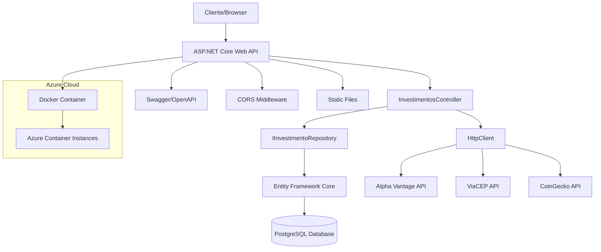
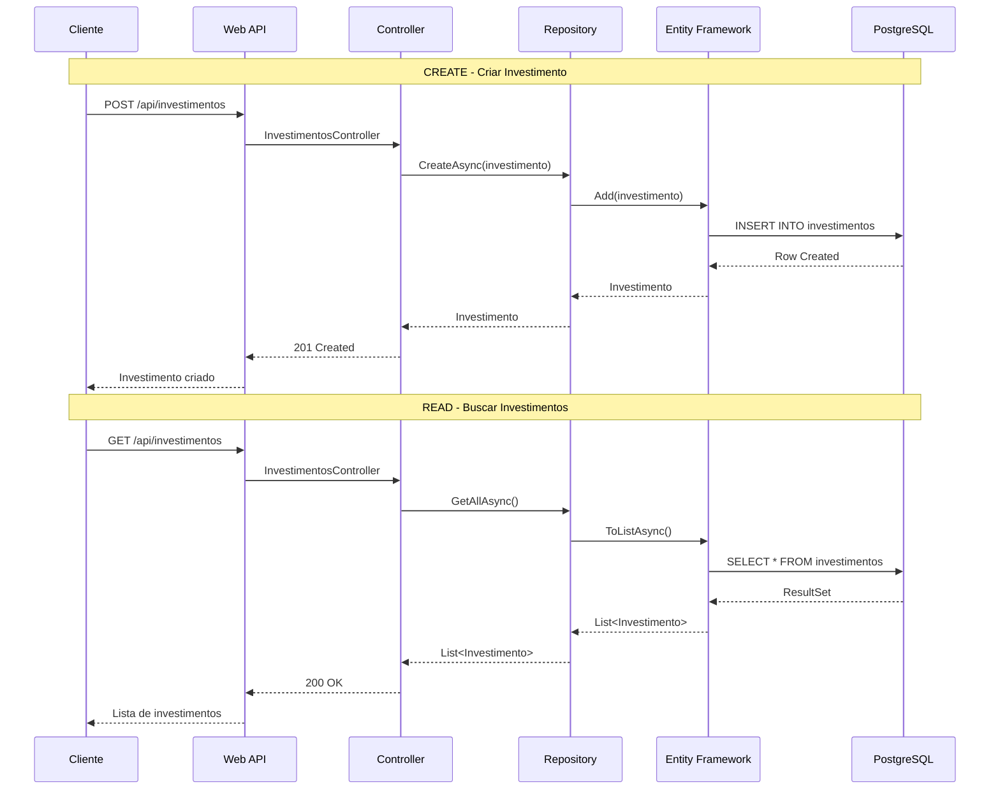
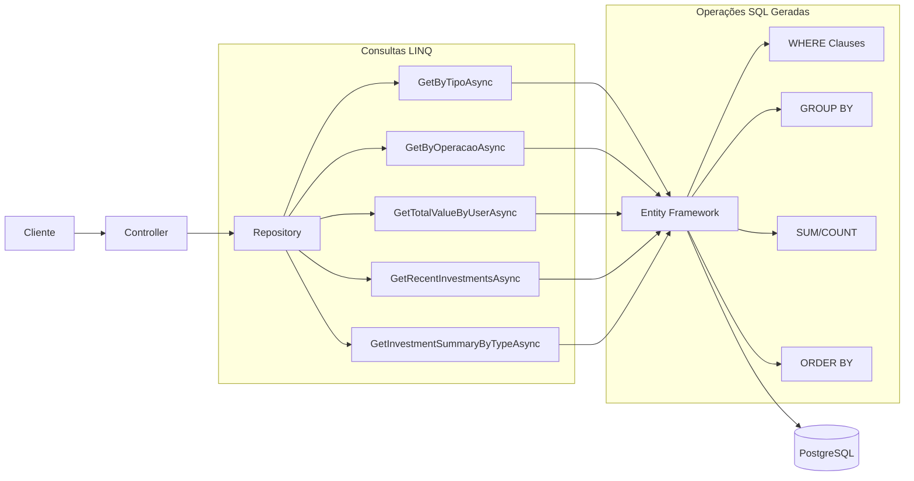
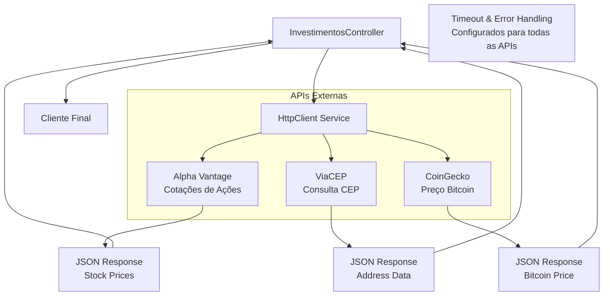
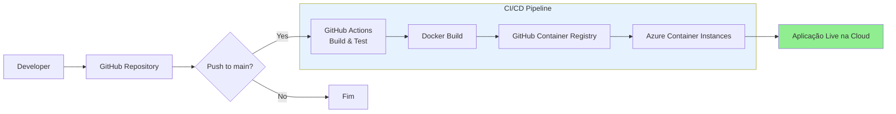
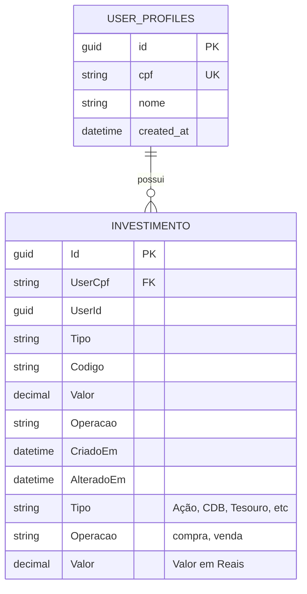
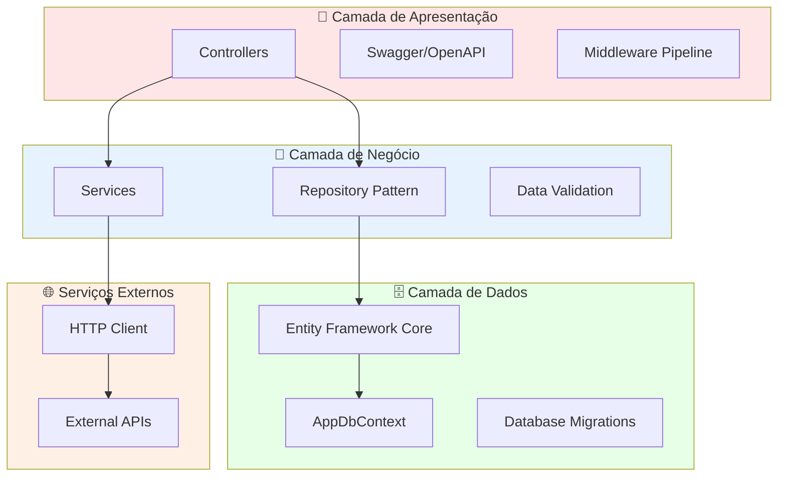
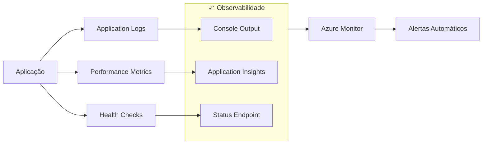

# 📊 Diagramas de Arquitetura - Investimentos API

## 🏗️ Arquitetura Geral do Sistema

## 🔄 Fluxo de Dados CRUD

## 🔍 Arquitetura de Consultas LINQ

## 🌐 Integração com APIs Externas

## 🚀 Pipeline de Deploy (CI/CD)

## 🗄️ Modelo de Dados

## 🛡️ Camadas da Aplicação

## 📊 Métricas e Monitoramento

---

### 🔍 Legenda dos Componentes

| Componente | Descrição | Tecnologia |
|------------|-----------|------------|
| **Web API** | Interface REST da aplicação | ASP.NET Core 9.0 |
| **Entity Framework** | ORM para acesso a dados | EF Core 9.0 |
| **PostgreSQL** | Banco de dados relacional | PostgreSQL (Supabase) |
| **Repository Pattern** | Abstração da camada de dados | Interface + Implementação |
| **LINQ** | Consultas integradas à linguagem | C# LINQ to Entities |
| **HttpClient** | Cliente HTTP para APIs externas | .NET HttpClient |
| **Docker** | Containerização da aplicação | Docker |
| **GitHub Actions** | Pipeline CI/CD | YAML Workflow |
| **Azure** | Plataforma de cloud | Azure Container Instances |
| **Swagger** | Documentação da API | Swashbuckle.AspNetCore |