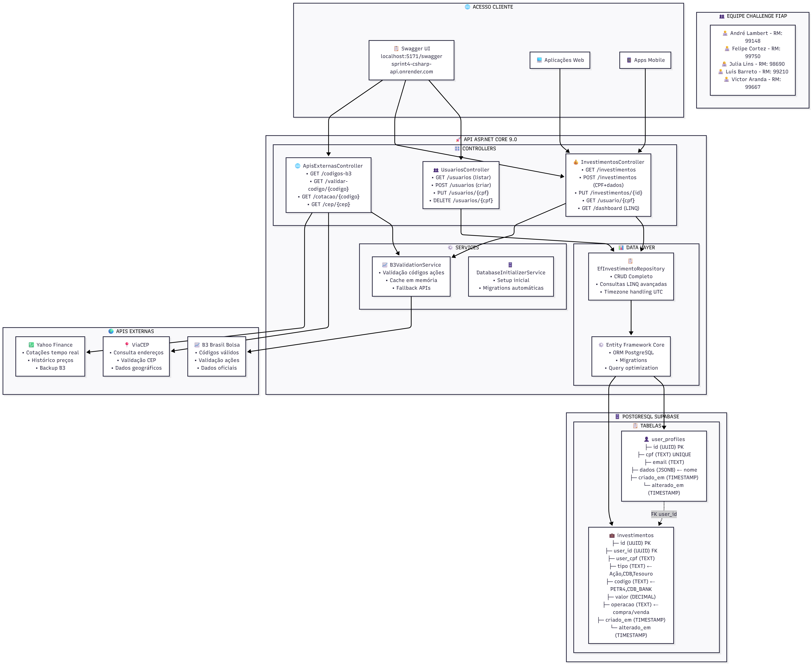
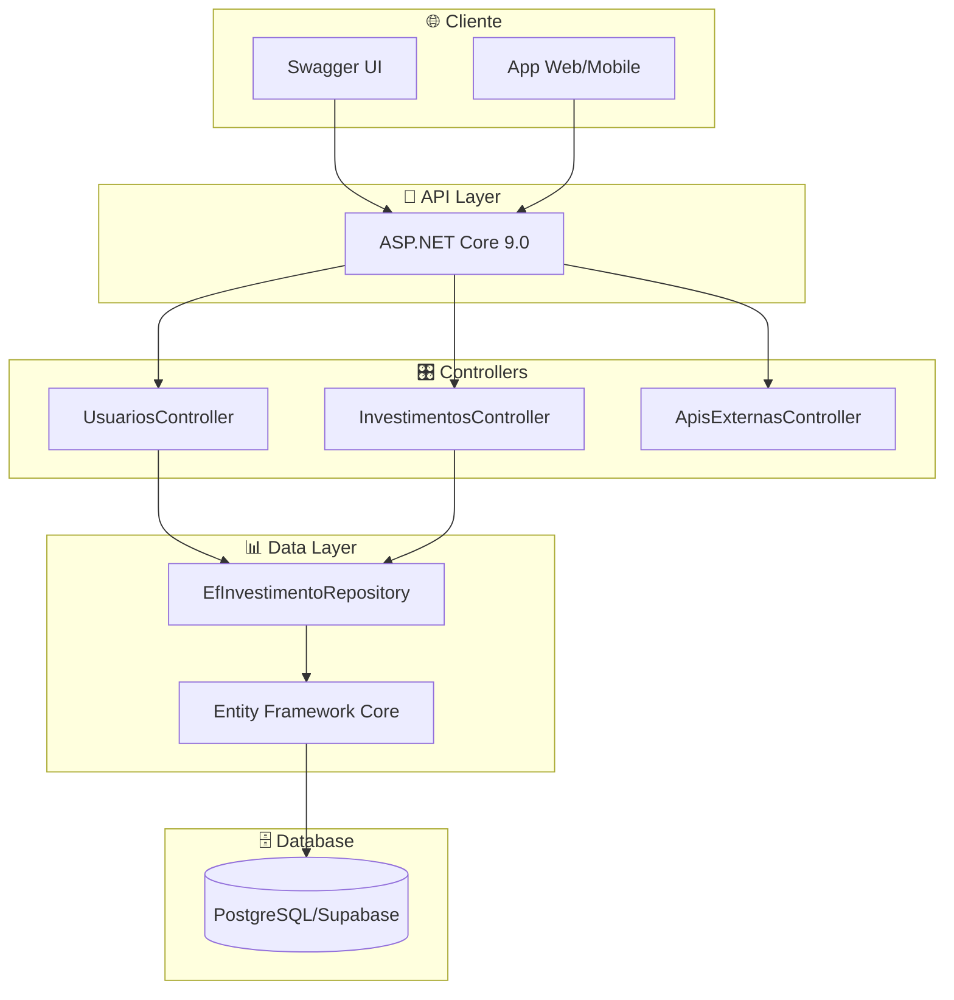

# � API de Investimentos - Challenge FIAP 2024

> **Sistema completo de gerenciamento de investimentos com ASP.NET Core 9.0 e PostgreSQL**

## 👥 **EQUIPE DESENVOLVEDORA**
- **André Lambert** - RM: 99148
- **Felipe Cortez** - RM: 99750  
- **Julia Lins** - RM: 98690
- **Luis Barreto** - RM: 99210
- **Victor Aranda** - RM: 99667

---

## 🎯 **SOBRE O PROJETO**

API RESTful moderna para gestão completa de investimentos, desenvolvida seguindo as melhores práticas de arquitetura e clean code. O sistema permite cadastro de usuários, gerenciamento de carteira de investimentos e integração com APIs externas para validação de dados.

### **� Principais Funcionalidades**

✅ **Gestão de Usuários**
- Cadastro com CPF e validação
- Nome armazenado em campo JSON (dados)
- Email opcional com validação

✅ **CRUD Completo de Investimentos**
- Criação simplificada (apenas CPF + dados básicos)
- Operações de compra e venda
- Suporte a ações, fundos, CDBs, Tesouro Direto

✅ **Consultas Avançadas com LINQ**
- Filtros por tipo, operação, período
- Cálculo de saldo líquido por usuário
- Dashboard com estatísticas agrupadas
- Relatórios de investimentos recentes

✅ **Integração com APIs Externas**
- Validação de códigos B3 (ações brasileiras)
- Consulta de cotações em tempo real
- Validação de CEP para endereços

✅ **Recursos Técnicos**
- Documentação completa com Swagger/OpenAPI
- Suporte a CORS para aplicações web
- Configuração multi-ambiente (dev/prod)
- Timezone handling para PostgreSQL

## 🛠️ **STACK TECNOLÓGICA**

| Tecnologia | Versão | Uso |
|------------|--------|-----|
| **ASP.NET Core** | 9.0 | Framework web principal |
| **Entity Framework Core** | 9.0 | ORM para acesso a dados |
| **PostgreSQL** | 16+ | Banco de dados relacional |
| **Supabase** | Cloud | Hospedagem do banco |
| **Swagger** | 6.6+ | Documentação da API |
| **Npgsql** | 9.0+ | Driver PostgreSQL |

## 🚀 **COMO EXECUTAR**

### **📋 Pré-requisitos**
- [.NET 9.0 SDK](https://dotnet.microsoft.com/download/dotnet/9.0) instalado
- Git para clonar o repositório
- Conexão com internet (banco na nuvem)

### **⚡ MÉTODOS DE EXECUÇÃO**

#### **🎯 Método 1: SUPER RÁPIDO (Recomendado)**

**Windows (Duplo-clique):**
1. Baixe o projeto
2. Execute o arquivo: `iniciar-api.bat`
3. Aguarde a mensagem: "📋 Swagger: http://localhost:5171/swagger"
4. Acesse o link automaticamente

**macOS/Linux:**
```bash
# 1. Clonar e executar
git clone https://github.com/lgustavobarre351/SPRINT4_CSHARP_API.git
cd SPRINT4_CSHARP_API
chmod +x iniciar-api.sh
./iniciar-api.sh
```

#### **�️ Método 2: Linha de Comando**
```bash
# 1. Clonar o repositório
git clone https://github.com/lgustavobarre351/SPRINT4_CSHARP_API.git

# 2. Navegar para a pasta do projeto
cd SPRINT4_CSHARP_API/Investimentos

# 3. Executar
dotnet run
```

#### **💻 Método 3: Visual Studio/VS Code**
1. Abra o arquivo `SPRINT4_CSHARP_API.sln` ou `Investimentos.csproj`
2. Pressione **F5** ou clique em "▶️ Run"
3. Swagger abrirá automaticamente

#### **🔄 Método 4: Desenvolvimento com Auto-reload**
```bash
cd SPRINT4_CSHARP_API/Investimentos
dotnet watch run  # Recarrega automaticamente ao salvar arquivos
```

#### **🔧 Método 5: Porta Customizada**
```bash
cd SPRINT4_CSHARP_API/Investimentos

# Windows PowerShell
$env:PORT="8080"; dotnet run

# macOS/Linux Bash  
PORT=8080 dotnet run

# Acesse: http://localhost:8080/swagger
```

### **🌐 URLs DISPONÍVEIS**

#### **💻 Local (após executar):**
- **🎯 Swagger Principal**: http://localhost:5171/swagger
- **🌐 API Base**: http://localhost:5171/api
- **💊 Health Check**: http://localhost:5171/api/TestConnection
- **📋 Ajuda Investimentos**: http://localhost:5171/api/investimentos/ajuda
- **👥 Ajuda Usuários**: http://localhost:5171/api/usuarios/ajuda

#### **🌍 Produção:**
- **🚀 Render**: https://sprint4-csharp-api.onrender.com/swagger

### **❓ PROBLEMAS COMUNS E SOLUÇÕES**

#### **Erro: "Porta 5171 já em uso"**
```bash
# Windows
netstat -ano | findstr :5171
# Anote o PID e execute: taskkill /PID [número] /F

# macOS/Linux  
lsof -ti:5171 | xargs kill
```

#### **Erro: ".NET não encontrado"**
- **Solução**: Instale .NET 9.0 SDK: https://dotnet.microsoft.com/download/dotnet/9.0
- **Verificar**: `dotnet --version` (deve mostrar 9.x.x)

#### **Erro: "Connection string/Database"**
- **Não se preocupe!** A API usa Supabase (nuvem)
- **Solução**: Verifique sua conexão com internet
- **Alternativa**: A API funcionará mesmo sem conexão (alguns endpoints)

#### **Erro: "Project not found"**
- **Solução**: Certifique-se de estar na pasta correta
- **Comando**: `cd SPRINT4_CSHARP_API/Investimentos`

### **💡 DICAS DE DESENVOLVIMENTO**

✅ **Para desenvolvimento ativo**: Use `dotnet watch run` (auto-reload)  
✅ **Para testar rapidamente**: Use `iniciar-api.bat` (Windows)  
✅ **Para debugging**: Use Visual Studio/VS Code com F5  
✅ **Para deploy**: A configuração já está pronta para Render/Azure  

### **📊 VISUALIZAÇÃO DA ARQUITETURA**


*Diagrama completo mostrando a arquitetura, fluxo de dados e relacionamentos da API*

## �📋 **DOCUMENTAÇÃO DA API**

### **👥 USUÁRIOS** `/api/usuarios`

| Método | Endpoint | Descrição |
|--------|----------|-----------|
| `GET` | `/api/usuarios/ajuda` | 🚀 Guia de uso da API |
| `GET` | `/api/usuarios` | 👥 Lista todos os usuários |
| `GET` | `/api/usuarios/{cpf}` | 🔍 Busca usuário por CPF |
| `POST` | `/api/usuarios` | 🆕 Cria novo usuário |
| `PUT` | `/api/usuarios/{cpf}` | ✏️ Atualiza usuário |
| `DELETE` | `/api/usuarios/{cpf}` | 🗑️ Remove usuário |

### **💰 INVESTIMENTOS** `/api/investimentos`

| Método | Endpoint | Descrição |
|--------|----------|-----------|
| `GET` | `/api/investimentos/ajuda` | 🚀 Guia de uso da API |
| `GET` | `/api/investimentos` | 📋 Lista todos os investimentos |
| `GET` | `/api/investimentos/{id}` | 🔍 Busca por ID |
| `GET` | `/api/investimentos/usuario/{cpf}` | 👤 Por usuário |
| `POST` | `/api/investimentos` | 💰 Criar investimento |
| `PUT` | `/api/investimentos/{id}` | 🔄 Atualizar investimento |
| `DELETE` | `/api/investimentos/{id}` | 🗑️ Remover investimento |

### **📊 CONSULTAS AVANÇADAS**

| Método | Endpoint | Descrição |
|--------|----------|-----------|
| `GET` | `/api/investimentos/tipo/{tipo}` | 📊 Filtrar por tipo |
| `GET` | `/api/investimentos/operacao/{operacao}` | 💰 Compras ou vendas |
| `GET` | `/api/investimentos/saldo/{cpf}` | 💵 Saldo líquido |
| `GET` | `/api/investimentos/recentes` | ⏰ Investimentos recentes |
| `GET` | `/api/investimentos/dashboard` | 📈 Dashboard resumo |
| `GET` | `/api/investimentos/usuarios` | 👥 Lista de CPFs |

### **🌐 APIS EXTERNAS** `/api/apisexternas`

| Método | Endpoint | Descrição |
|--------|----------|-----------|
| `GET` | `/api/apisexternas/codigos-b3` | 📈 Códigos B3 válidos |
| `GET` | `/api/apisexternas/validar-codigo/{codigo}` | ✅ Validar ação |
| `GET` | `/api/apisexternas/cotacao/{codigo}` | 💹 Cotação atual |
| `GET` | `/api/apisexternas/cep/{cep}` | 📍 Consultar CEP |

## 🗄️ **ARQUITETURA DO BANCO**

### **Tabela: user_profiles**
```sql
CREATE TABLE user_profiles (
  id UUID PRIMARY KEY DEFAULT gen_random_uuid(),
  email TEXT UNIQUE,
  cpf TEXT UNIQUE NOT NULL,
  dados JSONB,  -- {"nome": "João Silva"}
  criado_em TIMESTAMP DEFAULT NOW(),
  alterado_em TIMESTAMP DEFAULT NOW()
);
```

### **Tabela: investimentos**
```sql
CREATE TABLE investimentos (
  id UUID PRIMARY KEY DEFAULT gen_random_uuid(),
  user_id UUID REFERENCES user_profiles(id),
  user_cpf TEXT NOT NULL,
  tipo TEXT NOT NULL,        -- Ação, CDB, Tesouro, etc.
  codigo TEXT NOT NULL,      -- PETR4, CDB_BANCO, etc.
  valor DECIMAL(18,2) NOT NULL,
  operacao TEXT NOT NULL,    -- compra, venda
  criado_em TIMESTAMP DEFAULT NOW(),
  alterado_em TIMESTAMP DEFAULT NOW()
);
```

## 🎯 **EXEMPLOS PRÁTICOS**

### **Criar Usuário**
```json
POST /api/usuarios
Content-Type: application/json

{
  "cpf": "12345678901",
  "nome": "João Silva Santos",
  "email": "joao.silva@email.com"
}
```

### **Criar Investimento Simplificado**
```json
POST /api/investimentos
Content-Type: application/json

{
  "userCpf": "12345678901",
  "tipo": "Ação",
  "codigo": "PETR4",
  "valor": 1500.50,
  "operacao": "compra"
}
```

### **Atualizar Investimento**
```json
PUT /api/investimentos/{id}
Content-Type: application/json

{
  "tipo": "Ação",
  "codigo": "VALE3",
  "valor": 2000.00,
  "operacao": "venda"
}
```

## 🏗️ **ARQUITETURA DA SOLUÇÃO**



### **📁 Estrutura de Pastas**
```
├── Controllers/          # Endpoints da API
├── Models/              # Entidades e DTOs
├── Data/                # Context do Entity Framework
├── Repositories/        # Padrão Repository
├── Services/            # Lógica de negócio
├── Swagger/             # Configuração da documentação
└── Properties/          # Configurações de launch
```

## 🔒 **SEGURANÇA E VALIDAÇÃO**

✅ **Validações Implementadas**
- CPF: formato e unicidade
- Email: formato válido
- Valores: não negativos
- Operações: apenas "compra" ou "venda"
- Códigos B3: validação via API externa

✅ **Tratamento de Erros**
- Responses padronizados
- Mensagens descritivas
- Status codes apropriados
- Logging de exceções

## 🚀 **DEPLOY**

A aplicação está configurada para deploy automático em:
- **Render**: https://sprint4-csharp-api.onrender.com/swagger
- **Local**: http://localhost:5171/swagger

### **Variáveis de Ambiente**
- `PORT`: Porta da aplicação (automática no Render)
- `ConnectionStrings__DefaultConnection`: String de conexão PostgreSQL

## 📊 **DIAGRAMAS E DOCUMENTAÇÃO TÉCNICA**

### **🎨 Diagrama Principal**


*Visão completa da arquitetura, mostrando controllers, services, banco de dados e APIs externas*

### **📋 Diagramas Técnicos Detalhados**
Para visualizações completas e código Mermaid, consulte: **[diagrama-mermaid.md](diagrama-mermaid.md)**

🔹 **Arquitetura da API** - Visão completa dos componentes  
🔹 **Modelo de Dados (ERD)** - Relacionamentos entre tabelas  
🔹 **Fluxo CRUD** - Sequência de operações  
🔹 **Integração APIs Externas** - Fluxo de validação B3  
🔹 **Dashboard LINQ** - Métricas e agregações  
🔹 **Tratamento Timezone** - Solução PostgreSQL  

### **🎯 Como usar os diagramas técnicos**
1. Acesse o arquivo [diagrama-mermaid.md](diagrama-mermaid.md)
2. Copie o código Mermaid desejado
3. Cole em: [Mermaid Live Editor](https://mermaid-js.github.io/mermaid-live-editor/)
4. Ou use diretamente no GitHub/GitLab/Notion

## �📈 **ROADMAP FUTURO**

- [ ] Autenticação JWT
- [ ] Cache Redis para cotações
- [ ] Notificações por email
- [ ] Dashboard web em React
- [ ] Testes unitários e integração
- [ ] Docker containerization
- [ ] CI/CD com GitHub Actions

## 📜 **LICENÇA**

MIT License - Projeto acadêmico desenvolvido para o Challenge FIAP 2024.

---

**✨ Desenvolvido com dedicação pela equipe Challenge XP** | **🎓 FIAP - Faculdade de Informática e Administração Paulista**


